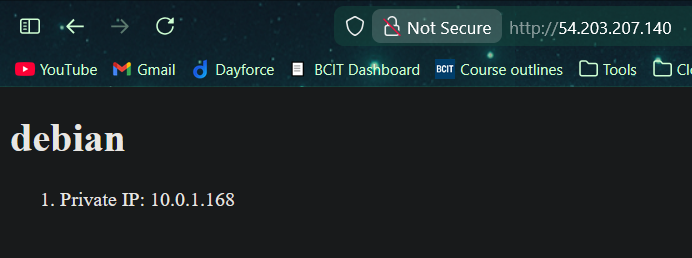

# acit4640-lab10

## Team

- Angad Bains
- Misha Makaroff

## create new keys

```bash
ssh-keygen -t ed25519 -f ~/.ssh/aws
```

This command will create the ssh key in the .ssh directory of the user. It will create a `aws` private key and a `aws.pub` public key.

## run included scripts to import and delete keys

```bash
./scripts/import_lab_key /home/anges/.ssh/aws.pub
```

This will add the newly created key to our logged in aws account.

```bash
./scripts/delete_lab_key
```

This removes the key from our aws account, as it is no longer needed.

## terraform commands

```bash
cd terraform/
terraform init
terraform apply
```

Using these commands we initialize terraform at the location where our terraform configuration (main.tf) is present. `Apply` allows us to create the ec2 instances as configured in our terraform file.

## Creating Roles

Run the following commands to create a scaffolding file structure for the 2 roles used:

1. This role will handle tasks related to our backend, Redis. This simply involves installing and starting up redis.

   ```bash
    ansible-galaxy role init rocky
   ```

2. This role will manage the frontend, nginx setup. This involves installing nginx, creating and moving required files to their locations, and starting up the service.

   ```bash
    ansible-galaxy role init debian
   ```

## Running the playbook and roles

```bash
ansible-playbook --check playbook.yml
```

After completing the playbook, run this to trouleshoot any issues with the current setup. It allows dry runs to verify the config.

```bash
ansible-playbook playbook.yml
```

Once satisfied, run the playbook with this command and it will execute the set configuration.

## rendered html page


